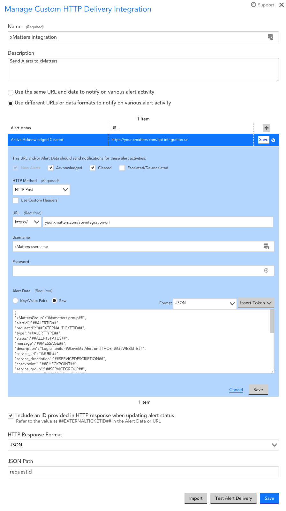
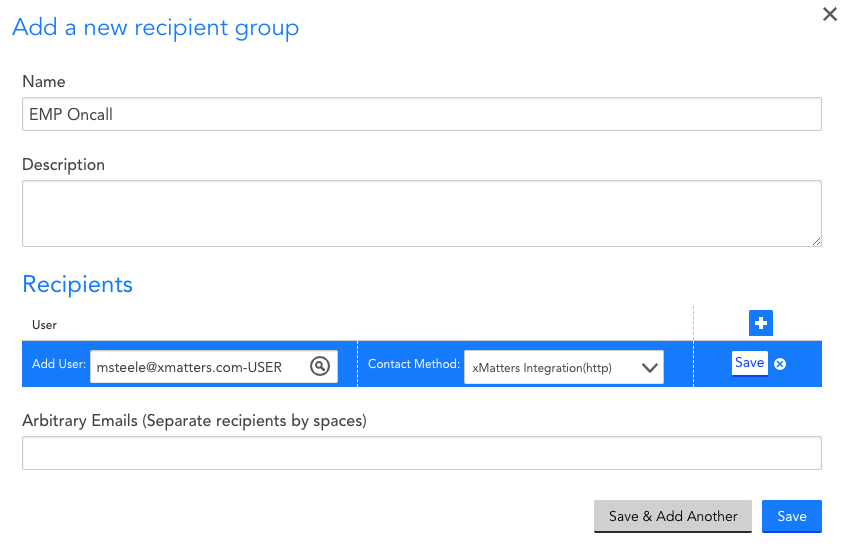
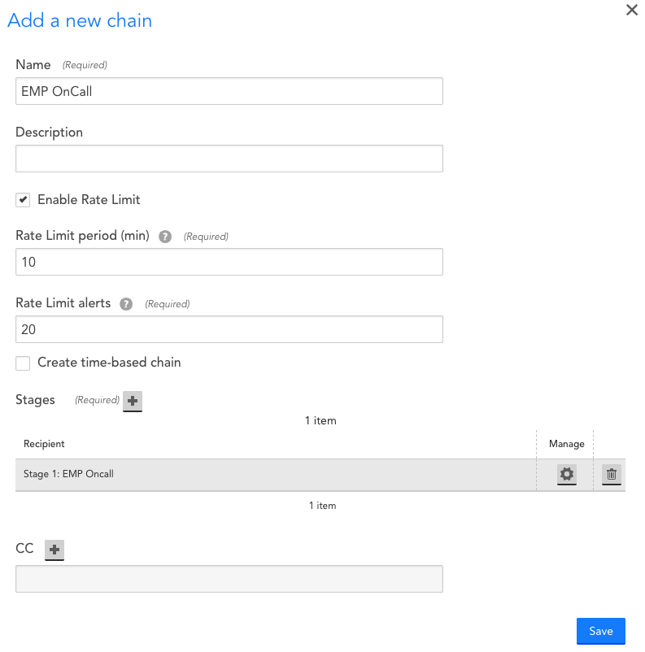
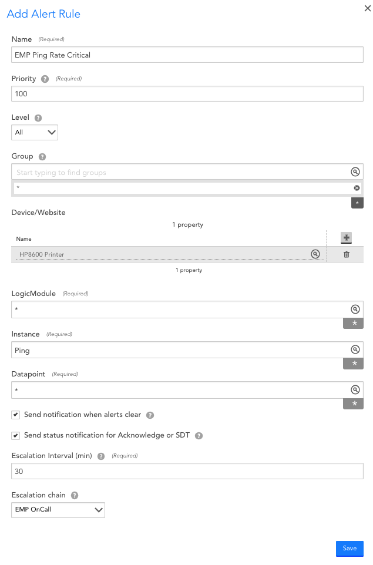
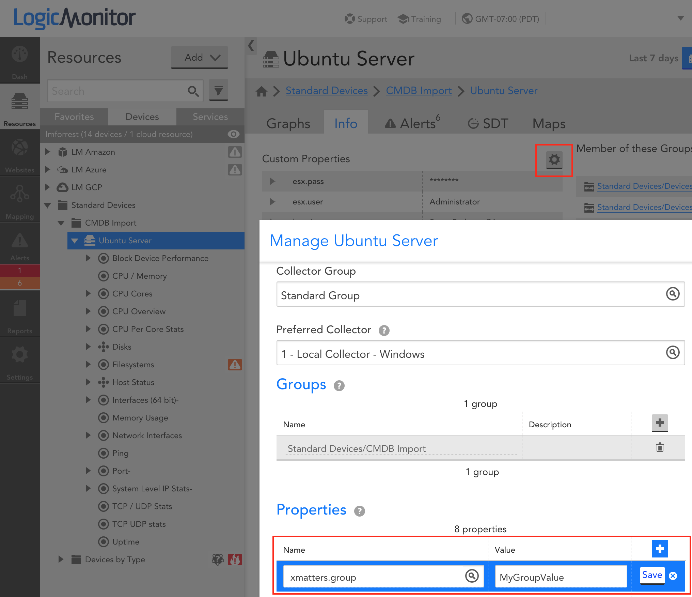
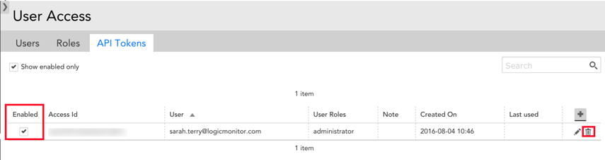

# LogicMonitor - Alerts
Automatically notify the appropriate on call resources on their preferred device when alert thresholds are met.
This integration helps you initiate xMatters notifications for LogicMonitor alerts.

<kbd>

</kbd>

# Pre-Requisites
* LogicMonitor (https://www.logicmonitor.com)
   * You must have a [collector installed](https://www.logicmonitor.com/support/settings/collectors/about-the-logicmonitor-collector/)
   * You must have [devices added and configured](https://www.logicmonitor.com/support/getting-started/i-just-signed-up-for-logicmonitor-now-what/4-adding-devices/)
   * You must add a [Custom Property](#add-custom-device-property) for the device defining the xMatters Group or Users recipients for the xMatters notifications.
* xMatters account - If you don't have one, [get one](https://www.xmatters.com)!

# Files
* xMatters
   * [LogicMonitor Workflow](xMatters/workflows/LogicMonitor.zip)
* LogicMonitor
   * [Integration Payload](LogicMonitor/logicmonitorAlertsPayload.json)

---
# How it works
Integrating xMatters with LogicMonitor allows you to automatically transfer key LogicMonitor alert data to xMatters alerts and drive workflows forward.

You can configure any alert rule in LogicMonitor to use the xMatters integration. When such a rule fires, it will trigger the LogicMonitor workflow specified by this integration.

xMatters will update the LogicMonitor notes field throughout the incident life cycle.
Because the notes field in LogicMonitor does not allow multiple values, this integration will append additional details with each update.

__xMatters will update the notes field when:__
- Notifications are created in xMatters.
- A comment is added to xMatters alert.
- A response (Acknowledge or Escalate) is made to the xMatters alert.

When a user responds with _Acknowledged_, a call will be made to LogicMonitor to update the notes and mark the alert as Acknowledged.

When an alert is resolved in LogicMonitor the corresponding xMatters alert will be terminated.

When a comment is added in response to xMatters notification it will be appended to the LogicMonitor Alert Notes field.

---
# Installation

## xMatters - Create an Integration User
#### :blue_book: NOTE
> If you do not already have an xMatters user specifically for integrations it is recommended to create one. This account should only be used for integrations and not need web login permissions. 
#### :warning: WARNING
> If the account you choose to use for this integration is removed or made inactive then the integration will break.

This integration requires a user who can authenticate REST web service calls when injecting events to xMatters.

This user needs to be able to work with events, but does not need to update administrative settings. While you can use the default Company Supervisor role to authenticate REST web service calls, the best method is to create a user specifically for this integration with the "REST Web Service User" role that includes the permissions and capabilities.

#### :blue_book: NOTE
> If you are installing this integration into an xMatters free instance, you don't need to create a new user. Instead, locate the "Integration User" sample user that was automatically configured with the REST Web Service User role when your instance was created and assign them a new password.

You have three options that can be used to authenticate the connection from LogicMonitor to xMatters:
1. API key using API key and Secret (Recommended)
   * You should create an [API key](https://help.xmatters.com/ondemand/user/apikeys.htm) under the __Integration User__ profile called something like LogicMonitor
   * > :pencil2: *Make sure to note the API key and Secret for LogicMonitor configuration later*
2. Basic Authentication using Username and Password
   * In this case you will use the __Integration User__ username and password
3. URL Authentication
   * In this option an API key is passed in the xMatters trigger URL query parameters
   * If using this method the proper URL with API key will be retrieved later in the instructions

---
## xMatters - Import and Configure the Workflow

The next step is to import the [LogicMonitor Workflow](xMatters/workflows/LogicMonitor.zip) following these [instructions](https://help.xmatters.com/ondemand/workflows/manage-workflows.htm#ImportExport)

---
## xMatters - Configure the LogicMonitor Endpoint
This will set the authentication parameters required to make requests into LogicMonitor for acknowledging and adding notes to LogicMonitor alerts.

1. From inside the __LogicMonitor__ Workflow go to the __Flow Desinger__ tab.
2. Click the dropdown in the top right called __Components__ and select __Endpoints__.
3. Click on the __LogicMonitor__ endpoint.
4. Change the Base URL. This should be the url of your LogicMonitor environment followed by __/santaba/rest__.
   Example: __https://company.logicmonitor.com/santaba/rest__
5. Endpoint Type should be __No Authentication__.
   - Authentication is done with in each Flow step
6. Save Changes

---
## xMatters - Get Trigger URL

1. From inside the __LogicMonitor__ workflow go to the __Flow Designer__ tab and click the __Alarms__ flow to open the canvas.
2. Now either double click the LogicMonitor trigger (circle step) at the beginning of the flow or hover and then selec the pencil from the context menu.
3. Select the type of __Authentication Method__ you would like to use.  As discussed before you can use three options:
   * __API Key__ - in this case just copy the URL and save for configuring LogicMonitor later
   * __Basic Authentication__ - in this case just copy the URL and save for configuring LogicMonitor later
   * __URL Authentication__ - if you choose this option also select the __Authenticating User__ you want all connection to be authenticated as (only users you supervise show up). Then copy the URL and save for configuring LogicMonitor later

---
## LogicMonitor - Configure Integration

1. Download the [xMatters-Integration.json](LogicMonitor/xMatters-Integration.json) file
2. Login to LogicMonitor.
3. Go to Settings.
4. Go to Integrations.
5. Click __Add__ Integration button.
6. Select __Custom HTTP Delivery__.
7. Click the Import button.  Browse for the __xMatters-Integration.json__ file.
8. Change the URL to the xMatters trigger URL copied from LogicMonitor workflow earlier. Make sure to remove the https:// from the beginning as this was copied from xMatters and should be set in the drop down not the path.
9. Set authentication
   * If you chose either __API Key__ or __Basic Authentication__ for the xMatter trigger then for Username enter either the xMatters __Integration User__ API key or username and for Password enter the xMatters __Integration User__ secret or password.
   * If you chose __URL Authentication__ then leave the Username and Password fields blank
10. Click __Test Alert Delivery__ and wait for a response.
11. Click __Save__ if the test is successful.

#### :blue_book: NOTE
> __xmatters.recipients__ is a LogicMonitor Custom Device Property you must include on each device that will be configured to create xMatters alerts.  The property can be configured directly on the device or inherited from a parent group. This property defines the Recipient Groups or Users to target in xMatters. [Add Custom Device Parameters](#logicmonitor---add-custom-device-property)

   <kbd>
      
   </kbd>

---
### LogicMonitor - Add Recipient Groups

1. Go to Settings.
2. Go to Recipient Groups.
3. Click Add button.
4. Name the Group.
5. Add a new recipient.
   - The selected recipient does not matter.
6. Set Contact Method to __xMatters Integration(http)__.
   - This is the name of the xMatters integration you created in the last step: [LogicMonitor Configure Integration](#logicmonitor---configure-integration)
7. Save Recipient.
8. Save Group.
9. Repeat for additional Groups.

    <kbd>
      
    </kbd>

More info on creating [LogicMonitor Recipient Groups](https://www.logicmonitor.com/support/settings/alert-settings/recipient-groups/)

---
###  LogicMonitor - Create Escalation Chain

1. Go to Settings.
2. Go to Escalation Chains.
3. Click Add button.
4. Name the Escalation Chain.
5. Optional - Configure Rate Limiting.
6. Add Recipient. The recipient should be a group that you created in last step: [LogicMonitor Add Recipient Groups](#logicmonitor---add-recipient-groups)
7. Save Escalation Chain.

    <kbd>
      
    </kbd>

More info on creating [LogicMonitor Escalation Chains](https://www.logicmonitor.com/support/settings/alert-settings/escalation-chains/)

---
###  LogicMonitor - Create Alert Rule

1. Go to Settings.
2. Go to Alert Rules.
3. Click Add button.

The most important thing you must do here is to configure the __Escalation Chain__.

* Select the escalation chain you just created in the last step: [LogicMonitor - Created Escalation Chain](#logicmonitor---create-escalation-chain)

4. Save Alert Rule.
5. Add additional Alerts for each Data source / Alert Level that you want to notify with xMatters.

   <kbd>
      
   </kbd>

More info on creating [LogicMonitor Alert Rules](https://www.logicmonitor.com/support/settings/alert-settings/alert-rules/)

---
###  LogicMonitor - Add Custom Device Property
#### :blue_book: NOTE
> This property can be configured directly on the device or inherited from a parent group.

To add to devices directly:
1. Go to Resources.
2. Select a Device configured to target the xMatters Integration.
4. Go to Info Tab.
5. Click the Cog beside Custom Properties.
6. Add the following Custom Property:
   #### :warning: WARNING
   > The value that you set here must match the names of a groups and/or users in xMatters. If it does not match your notification will not go to anyone.
   * __Name:__ xmatters.recipients
   * __Value:__ {{comma seperated list of xMatters groups or users to notify}}
7. Repeat this step for each device you want to notify with xMatters.

   <kbd>
      
   </kbd>

More info on creating [Device Properties](https://www.logicmonitor.com/support/devices/adding-managing-devices/device-properties)

---
### LogicMonitor - Get API Token
In order for xMatters to acknowledge and/or add notes to LogicMonitor alerts an API Token and Access ID are required.

API tokens are created on a per user basis from the Manage Users Dialog within LogicMonitor.
https://www.logicmonitor.com/support/settings/users-and-roles/users/#apitokens

> :pencil2: *After adding a LogicMonitor API Token make sure to copy it as it will only be displayed once.*

#### :blue_book: NOTE
> When creating a user, you may want to use the __API Only Access__ toggle. This will create a user that can only access LogicMonitor for the purposes of this integration.

1. Create User for LogicMonitor Integration. Make sure it has appropriate LogicMonitor roles / permissions.
2. Copy LogicMoitor API Token.

   <kbd>
      
   </kbd>

---
### LogicMonitor - Get Access ID

1. In LogicMonitor go to the __Settings > API Tokens__ Tab. Here you will see the Access ID of the API token you just created.
   * https://www.logicmonitor.com/support/settings/users-and-roles/api-tokens/
2. Copy appropriate LogicMoitor Access ID.

   <kbd>
      
   </kbd>

---
### xMatters - Set Constants
There are two constants that must be configured in the LogicMonitor xMatters Workflow.
1. In the target xMatters system go to the __Workflows__ tab.
2. Click the name of the __LogicMonitor__ workflow to open it.
3. Go to the __Flow Desinger__ tab.
4. In the top right client the __Components__ dropdown and select __Constants__.
5. Set __LogicMonitor - Access ID__. [Instructions](#logicmonitor---get-access-id)
6. Set __LogicMonitor - Access Key__. [Instructions](#logicmonitor---get-api-token)

LogicMonitor Instructions:
[LogicMonitor Access ID](https://www.logicmonitor.com/support/settings/users-and-roles/api-tokens/)
[LogicMonitor API Token](https://www.logicmonitor.com/support/settings/users-and-roles/users/#apitokens)

---
## Testing and Troubleshooting

Go LogicMonitor Integration. Follow instructions here: [LogicMonitor - Configure Integration](#logicmonitor---configure-integration)
* Click __Test Alert Delivery__.

Trigger a new LogicMonitor Alert check that it makes its way into xMatters.

You can check the Activity log in xMatters:
https://help.xmatters.com/ondemand/flowdesigner/activity-panel.htm